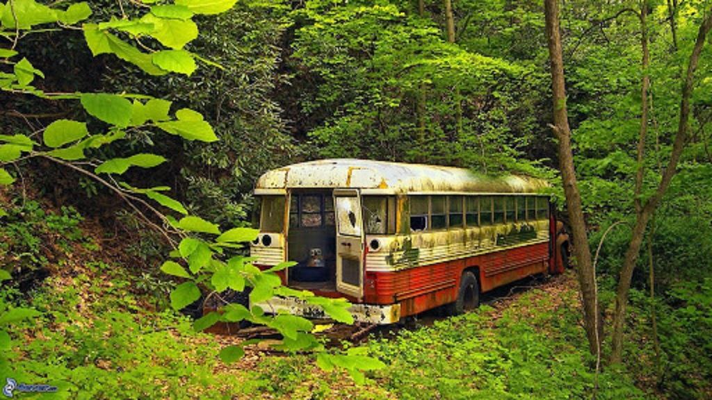

# essais
<!DOCTYPE html>
<html>

  <head>
    <meta charset="utf-8" />	   <!--Indique le type de codage des caractères-->
	<link rel="stylesheet" href="style.css" />  	<!--lien vers le fichier css-->
    <title>Epaves</title>			<!--titre de l'onglet de la page-->
	<body background="grandfondbois.jpg">  <!-- insertion d'une image de fond-->
  </head>

  <body>
    <header>
	  
      <h1>EPAVES</h1>   <!--titre principal de la page-->
	</header>

  <nav role='navigation'>    <!-- Balise dédiée aux éléments de navigations-->
      <a href="index.html">Accueil</a>    <!-- Lien vers la page index-->
      <a href="sous-marines.html">Epaves sous-marines</a> <!-- Lien vers la page recyclage.html-->
      <a href="terrestres.html">Epaves terrestres</a>
  </nav>
  
  <section>
		
  </section>

	
 Maintenant, c'était comme si pour la première fois, dans cette vieille épave de car 
	scolaire, sur ce terrain minable, j'avais trouvé un vrai foyer et une vraie famille. 
	"Sous le règne de Bone" (1995) de Russell Banks 

  </body>
</html>
